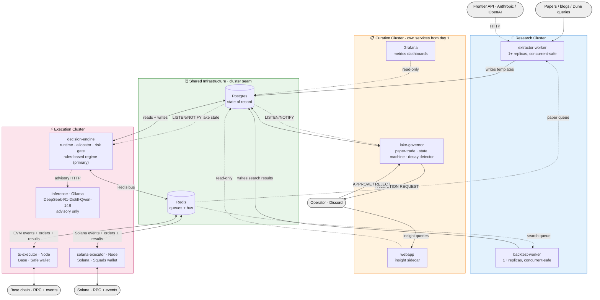

<!--
PROVENANCE: This is the repo-side copy of the approved Icarus v2 design.
Source: ~/.gstack/projects/0xobat-icarus/obat-0xobat-design-v2-review-design-20260504-084755.md
Generated: /office-hours skill on 2026-05-04 (Builder mode)
Approved: 2026-05-04 by 0xObat
This file is the active build spec for the daedalus branch. If it disagrees
with anything in .archive/docs/ (v4.2 system-design.md or v2 draft), this
file wins.
-->

# Design: Icarus v2 — Strategy Lake Architecture

Generated by /office-hours on 2026-05-04
Branch: 0xobat/design-v2-review
Repo: icarus
Status: APPROVED · 2026-05-04
Mode: Builder

## Problem Statement

Build an autonomous DeFi trading bot that ingests strategies from research sources (papers, blogs, on-chain analytics) and trades them profitably for a single operator (the user). The system must validate strategies before risking capital, allocate across a validated set based on market regime and portfolio state, execute on-chain, and surface results to a single operator with minimal daily monitoring load.

The hard part is finding edge, not executing trades. The bet underneath this design is that **the alpha is in the parameter-space search, not in any individual paper.**

## What Makes This Cool

- A paper drops Tuesday. By Friday, the bot has grid-searched its parameter space across the asset universe, walk-forward-validated the top configurations on out-of-sample data, and is paper-trading 10+ candidates. Nothing manual happened.
- The bot's intelligence is the _search_, not any single strategy. After 20 papers ingested, the lake has potentially 2,000 candidate configurations and maybe 50 live, all chosen by walk-forward performance. The compounding is the system.
- Asset-universe expansion is free. A paper that tested only BTC instantly gets tried on ETH, SOL, ARB, etc. — without re-asking the LLM.
- It works while you sleep, and the dashboard you check Saturday morning shows you which templates compounded value over the week, not which trades fired.

## Constraints

- **Single operator** (just the user, no co-builders, no customers).
- **2-day blueprint window** for this design doc (now landing). **10-week build** for v1 ship.
- **Archive frontend** — the existing Next.js app at `frontend/` is sunk cost; do not maintain it. Monitoring goes to Grafana + Discord (Streamlit deferred to v2 if Grafana proves insufficient).
- **Keep `ts-executor/`** as a separate Node process for chain listeners, TX builder, Safe wallet, and encode-only adapters. Python's Safe SDK is less mature than `safe-eth-py`-via-TS — rewriting this layer would cost 2-3 weeks for negligible gain.
- **Fresh Python skeleton** for the brain, decomposed into a 6-service / 3-cluster architecture (Research / Curation / Execution; see Architectural style section). Replaces the existing `py-engine/` rather than evolving it in place.
- **Archive-first build discipline.** Day 1 of week 1: move the entire current codebase to `.archive/` at the repo root. The working tree starts effectively empty (only `.archive/`, root config files, and the new v2 service skeletons created in week 1 day 1). Every module reused from v4.2 — including `ts-executor/`, `risk/`, `db/`, `AllowlistGuard.sol`, `shared/schemas/`, hand-written reference strategies — is copied back from `.archive/` only after explicit validation that it works as-is in the new tree. New v2 code (`decision-engine/`, `extractor-worker/`, `backtest-worker/`, `lib/`) is written from scratch. This creates a hard visual seam between old and new, makes every "we keep this" claim an explicit validation step, and gives rollback a trivial recovery path.
- **Hand-written strategies in `.archive/py-engine/strategies/`** (`aave_lending.py`, `aerodrome_lp.py`) become the v1 reference templates the lake architecture is validated against — copied to `templates/LEND-001/` and `templates/LP-001/` only after validation, not edited in place.
- **Base + Solana** at v1 launch. Two parallel chain executors: `ts-executor` (Node, EVM/Base, Safe multisig wallet) and `solana-executor` (Node, Solana, Squads multisig wallet). Arbitrum / Optimism / other L2s deferred.
- **Human approval at the live-promotion gate** is mandatory; the gate is not auto-bypassed even when paper-trade gates pass.

## Architectural style and domain clusters

### Three domain clusters

Components are grouped by what each does to a candidate strategy across its lifecycle: discover it, manage its state, trade it. Three clusters, named for the lifecycle phase they own:

| Cluster | Owns | Cadence | Capital-touching? |
|---|---|---|---|
| **Research** | Extracting templates from research sources, parameter-search over the template space, walk-forward validation | Bursty, batch, offline | No |
| **Curation** | Paper-trade observation, lake state machine, decay detection, per-template breaker, monitoring | Continuous, low-throughput | No (shadow positions only) |
| **Execution** | Per-cycle runtime loop, allocator, pre-trade risk gate, on-chain execution | Continuous, latency-sensitive | **Yes** |

Each cluster reads and writes its own Postgres tables. Cross-cluster communication happens through Postgres as the source of truth (durable state) and Redis as ephemeral signals (queue messages, runtime cycle ticks). **No cluster makes direct service-to-service calls into another cluster's components.** That's what makes clusters independently startable, stoppable, and replaceable.

### Architecture diagram



**How to read the diagram:**

- **Four colored regions** = three domain clusters (Research, Curation, Execution) plus shared infrastructure. External actors (papers, two chains, operator, frontier API) are grey.
- **Postgres is load-bearing.** Every cluster has an arrow into it; cross-cluster reads happen through it. If a future revision adds an arrow between two cluster boxes that *bypasses* Postgres, that's a violation of the cluster-seam invariant.
- **Curation is split from day 1.** `lake-governor` is its own service, not co-located with `decision-engine`. Cross-cluster reads (Execution allocator needs lake state, Curation needs Execution PnL for decay detection) happen via Postgres LISTEN/NOTIFY — shown by the dotted reverse arrows.
- **Three arrows legitimately bypass Postgres** because of structural constraints: (a) Execution → `inference` (HTTP per cycle, in-cluster, latency-tolerant but bounded); (b) Execution ↔ `ts-executor` and `solana-executor` (Redis bus, the Python/Node boundary requires a message protocol); (c) external IO to chains and frontier API.
- **`inference` is dotted because it's advisory only** — the runtime cycle never blocks on it. The rules-based regime classifier inside `decision-engine` is the primary signal; LLM regime is logged alongside as enrichment (see Q2 in the locked decisions). If Ollama is down, the cycle continues uninterrupted on rules-based regime.
- **Two chain executors** (`ts-executor` for Base, `solana-executor` for Solana) are parallel siblings in the Execution cluster. Each owns its multisig wallet (Safe for EVM, Squads for Solana) and its adapter set. The Redis bus carries `chain` field in every order so `decision-engine` routes orders to the right executor.
- **Worker queues** (paper queue, search queue) are Redis lists; workers are stateless concurrent-safe consumers (atomic claim via Redis BLMOVE with visibility timeout) that write results back to Postgres.
- **`webapp` is an insight sidecar**, not a control plane. Operator uses Discord for approvals and alerts; `webapp` is for "what is the bot thinking right now and why" — narrative views of allocator reasoning, candidate-level traces, lake state.

### Nine-service decomposition

| Service | Cluster | Scale shape |
|---|---|---|
| `extractor-worker` (Python) | Research | **Horizontal worker pool**, consumes paper queue, code multi-replica-safe from day 1, starts with 1 replica on 1 core |
| `backtest-worker` (Python) | Research | **Horizontal worker pool**, consumes search queue, code multi-replica-safe from day 1, starts with 1 replica |
| `lake-governor` (Python) | Curation | **Split from day 1** — vertical singleton owning paper-trade harness, candidate state machine, decay detector, per-template breaker. No longer co-located with Execution. |
| `webapp` (Python or Node, FastAPI / Next.js) | Curation | **Insight sidecar** — read-only dashboard surfacing bot reasoning, allocator commentary, lake state, candidate-level traces. Discord remains the alerting + approval channel; this is for understanding, not control. |
| `grafana` (sidecar) | Curation | Read-only metric dashboards on Postgres. Complementary to `webapp`: Grafana for time-series + alerts, `webapp` for narrative / reasoning views. |
| `decision-engine` (Python) | Execution | Vertical singleton — runtime cycle, allocator (with cold-start + risk-parity), pre-trade risk gate, rules-based regime classifier (primary). |
| `inference` (Ollama for v1, vLLM for v2) | Execution-adjacent | Vertical, swappable. **Advisory role only** — cycle never blocks on it. |
| `ts-executor` (Node) | Execution | Vertical singleton — Base chain listeners, TX builder, Safe multisig wallet, EVM adapter pattern. |
| `solana-executor` (Node) | Execution | Vertical singleton — Solana chain listeners, TX builder, Squads multisig wallet, Solana adapter pattern (Jupiter for swaps, Drift / Kamino / MarginFi for venues). |

Plus shared infrastructure: `postgres` (state of record), `redis` (cache + queues + bus).

Total: **9 application services + 2 data services**. The service count is higher than the original 6 because three architectural decisions — multi-chain (Q6), lake-governor split (Q9), and webapp sidecar (Q5) — each added one or more services. Operational tax is real but earns its way: each added service has a clear cluster ownership, a clear scale shape, and a clear deploy boundary.

**Curation now genuinely external from Execution.** Postgres transactions cannot span `lake-governor` and `decision-engine`; cross-cluster reads happen through Postgres state + LISTEN/NOTIFY (or short polling) on changed tables. This is a stricter discipline than the original "co-locate in decision-engine for v1" plan, and it earns the "stop one cluster, others keep running" property structurally rather than by convention.

### Inside each service: monolithic-modular with Protocol + DI

Every Python service is a single process with internal modules organized as Python packages. Each module exports a `Protocol` interface; concrete implementations satisfy the Protocol; the service's `__main__` constructs the dependency tree at startup. Tests target the Protocol, not the impl. Swapping an implementation is changing one import.

This gives the plug-and-play property (remove, replace, work on, restart-safe) at module granularity *inside* a service, and at cluster granularity *across* services. Process isolation is reserved for components that genuinely benefit (LLM-touching boundaries, chain-touching boundary), not paid as a tax on every component.

### LLM placements — advisors, not gates

The system uses LLMs at two structural points (extractor calls frontier; runtime regime classifier calls Ollama) and as advisors at several decision points. **No LLM is in the firing path of any capital-protecting gate.**

| Where | Pattern | What the LLM does | What it cannot do |
|---|---|---|---|
| Extractor → frontier (Anthropic / OpenAI) | Structural | Reads paper/blog → emits manifest + `evaluate.py` + `smoke_test.py` + `parameter_rationale.md` | Bypass smoke test or AST lint |
| Runtime regime classifier → Ollama | **Advisor only** (Q2 locked) | Once-per-cycle regime + confidence + rationale, logged alongside the rules-based deterministic regime signal | Block the cycle; gate any decision; override rules-based regime |
| Allocator | Pure advisor | Writes commentary on each cycle's allocation; flags concentration risk, regime mismatch, implementation hazards | Change the allocation |
| Lake promotion `live_capped → live_mature` | Advisor in operator message | Writes a paragraph review for the operator's Discord PROMOTION REQUEST | Promote without operator |
| Lake decay → demotion | Post-action explanation | Writes hypothesis for *why* decay happened, in Discord followup | Block the demotion |
| Risk circuit-breaker firing | Post-action explanation | Writes operator-readable Discord message after the breaker fires | Anywhere in the firing path |
| Risk pre-trade order check | None | — | Anywhere |
| Backtest result acceptance | Veto-only advisor | Flags suspicious patterns (curve-fit, regime confinement) for operator review | Auto-reject |
| Strategy template plausibility check | Veto-only advisor | Reviews extractor output for plausibility before search queue | Auto-reject |

Capital-protecting gates (risk pre-trade, circuit breakers, decay-driven demotion) are deterministic and synchronous. LLMs run alongside them as advisors, never inside them.

### Reversibility — one-way door to agents/MCP

If v3 ever needs full agent-with-protocol architecture (multi-operator, external strategist marketplace, polyglot agents), the migration is mechanical *because* every module already exports a `Protocol` interface. Each Protocol becomes an MCP server interface; each consumer becomes an MCP client. No business-logic changes, only seams. v1 doesn't pay for this; v3 can adopt it with bounded effort.

## Premises

1. **The hard part of crypto trading is finding edge, not executing it** — accepted, scoped to the venues this system targets (Base + lending + LP + structured tier when Dune comes online). If the open-ended scope produces a strategy whose execution path the v4.2 wallet/adapter layer can't realize, the strategy is rejected at the gate.

2. **Research papers + DeFi research blogs contain extractable, profitable edge** — accepted with amendment: v1 input includes both papers AND research blogs (Paradigm, a16z crypto, Bankless deep-dives) from day 1. Pure-arXiv-only would starve the bot; crypto-specific edge concentrates in blogs.

3. **The hybrid manifest+Python representation holds at scale** — accepted. Manifest carries the comparable spine the lake's allocator and ranker need; Python `evaluate(params, market_data, portfolio_state)` carries arbitrary logic. Schema validation + AST lint + extractor-emitted smoke test enforce the seam.

4. **Backtest + paper-trade gates are sufficient to prevent live capital loss** — accepted with strengthening: v1 ships with walk-forward analysis, regime-segmented out-of-sample, deflated Sharpe ratios, and a hard cap on per-strategy live allocation until N weeks of green-zone live performance.

5. **A 10-week build is feasible at the chosen scope** — accepted. The Dune tier is mandatory by week 4 (parameter-sweep backtests on basis/perp/LST templates can't run on APY-replay alone), which compresses the timeline less than it sounds because the Dune adapter is a defined unit of work, not a research project.

6. **The fresh-Python brain ports the v4.2 risk + Postgres layers cleanly** — accepted. `ts-executor/` is kept; only the brain is rewritten. Risk module ports verbatim; Postgres schema mostly intact with new tables for templates, candidates, lake state, and walk-forward results.

## Approaches Considered

### Approach A: Two-process icarus (minimal viable)

**Summary:** Keep `ts-executor/` as-is; replace `py-engine/` with a fresh Python service that owns extractor, DSL runtime, backtest, paper-trade, runtime AI, and allocator. They communicate over the existing Redis bus. APY-series backtest only in v1; equal-weight allocator; Ollama-served DeepSeek-R1-Distill-Qwen-14B for runtime regime classification.
**Effort:** M (6 weeks) — **Risk:** Med
**Pros:** Realistic 6-week ship; proven execution layer untouched; every "ideal" element of B and C is a future-compatible upgrade.
**Cons:** Redis bus survives; equal-weight allocator under-allocates to high-conviction strategies; APY-only backtest can't validate strategies whose alpha depends on pool depth or gas; one paper produces one strategy, not a search surface.
**Reuses (after archive-first validation, copied from `.archive/`):** Entire `ts-executor/`, `py-engine/risk/`, `py-engine/db/` schema (extended), `shared/schemas/`, Safe wallet pattern, `AllowlistGuard.sol`, encode-only adapter pattern.

### Approach B: Fresh skeleton, every component first-class

**Summary:** Same scope as A but every component built for the v3 future. Extractor as LLM agent loop with retry/repair. Backtest engine event-driven with pluggable data adapters. Risk-parity allocator from day 1. vLLM-served DeepSeek-R1-Distill-Qwen-32B for batched runtime inference.
**Effort:** L (8-9 weeks) — **Risk:** Med-High
**Pros:** No v1→v2 rewrite waste; risk-parity allocator and vLLM batching from day one; backtest engine designed for the Dune tier from inception.
**Cons:** Blows the original 6-week budget by 30-50%; vLLM ops surface (GPU host, model serving) is net-new infra alongside the rest; risk-parity covariance estimation is noisy at small N before the lake compounds.
**Reuses:** Same as A.

### Approach C: Strategy lake (chosen)

**Summary:** Reframe the extractor's output. Instead of one strategy per paper, the extractor emits a _template_ — a manifest with parameter ranges and an asset universe — plus a parameterized `evaluate(params, market_data, portfolio_state)` function, plus a `parameter_rationale.md` justifying the search space. The backtest engine grid- or Bayesian-searches the parameter space across assets, emits a result surface, and walk-forward-validates the top-K configurations. Paper-trade runs the top-K in parallel. Live allocator picks across the union of all top-K configurations across all templates. The bot becomes a strategy-search engine, not a strategy-runner. Implemented as the **9-service / 3-cluster decomposition** described in Architectural style above: Research workers (`extractor-worker`, `backtest-worker`) scale horizontally, Curation runs as its own service set (`lake-governor` + `webapp` + Grafana) from day 1, Execution comprises `decision-engine` + two chain executors (`ts-executor` for Base, `solana-executor` for Solana) + advisory-only `inference`.
**Effort:** L-XL (10+ weeks) — **Risk:** High
**Pros:** Bot's intelligence is the search itself; the lake compounds across papers; matches the "research-cycle speed" magic moment when a single paper produces 30-200 candidates overnight; robust against author parameter cherry-picking; asset-universe expansion is free.
**Cons:** Combinatorial backtest cost demands the Dune tier early; overfitting is the central failure mode and demands real quant discipline (walk-forward, regime-segmented out-of-sample, deflated Sharpe); extractor task is harder (identifying parameter ranges in a paper, not just the strategy); lake governance (decay detection, demotion) becomes a first-class subsystem.
**Reuses:** Same as A, but allocator/backtest/extractor semantics fundamentally change.

### Approach C-lite: Strategy lake with discipline cap

**Summary:** Same reframe as C, but lake size capped at 5-10 templates × 10-30 params = 50-300 candidates. APY-replay stays the v1 default; templates needing pool-state simulation wait for the Dune tier. Walk-forward and risk-parity from day 1.
**Effort:** L (7 weeks) — **Risk:** Med-High
**Pros:** Captures the reframe with shipping discipline; forces walk-forward and risk-parity from day 1.
**Cons:** Three commitments at once (walk-forward, risk-parity, Dune-tier-earlier); any slip pushes the timeline.
**Reuses:** Same as A.

## Recommended Approach: C — Strategy Lake (full)

The user chose C deliberately after asking for more detail and seeing the full tradeoff. This signals that the reframe — the bot's intelligence is the parameter-space search, not any single paper — is the actual product they want to build. C-lite would have been the safer bet; C is the bet on conviction.

The architectural style is **monolithic-modular within services, microservice-cluster across services**: 2 horizontally-scalable Research workers, Curation as its own service set from day 1 (`lake-governor` + `webapp` + `grafana`), 1 vertical `decision-engine` for Execution, 2 chain-specific executors (`ts-executor` for Base + `solana-executor` for Solana), advisory-only `inference`. **Nine application services + 2 data services.** Components are organized into the three domain clusters (Research / Curation / Execution) with Postgres as the cluster seam — and now that Curation is genuinely split from Execution, cross-cluster reads happen via Postgres LISTEN/NOTIFY rather than shared transactions. FAOF-style 9-agent decomposition was considered and rejected; the seams to migrate to it (Protocol interfaces) are in place if v3 needs them.

### Component design

Components below are grouped by **cluster**. The cluster a component belongs to determines which service hosts it and which Postgres tables it owns.

### Research cluster components

**Extractor (`extractor/`)**

- CLI: `extract-strategy <pdf|url|dune-query-id>` — accepts research source, calls frontier LLM (Claude Opus 4.7 or GPT-class), emits a template directory:
  - `templates/<id>/manifest.yaml` — id, sources, asset_universe, params (with ranges), allocation_max, risk_profile, expected_metrics, semver, source_doc_ref.
  - `templates/<id>/evaluate.py` — single function: `evaluate(params: dict, market_data: MarketSnapshot, portfolio_state: PortfolioSnapshot) -> Decision`. AST-linted (no I/O, no network, allowlisted imports).
  - `templates/<id>/smoke_test.py` — extractor-populated test cases verifying `evaluate` returns sane Decisions on canned inputs. Required to pass before the template enters the search queue.
  - **`templates/<id>/parameter_rationale.md`** (Q8 locked) — free-text justification from the extractor for each parameter range. Why is `funding_threshold` in [0.02%, 0.5%]? What does the source paper say? Why these asset choices? Required artifact. Read by the **LLM-as-judge plausibility check** that gates whether the template enters the search queue.
- Frontier LLM is invoked offline, infrequently — once per paper, with a paper-extractor prompt that explicitly asks for parameter _ranges_, not a single fitted value, and demands the rationale doc as part of the output.
- **Template plausibility check (Q8 extra defense):** after extraction, a separate LLM-as-judge pass reads `manifest.yaml` + `parameter_rationale.md` + `evaluate.py` and answers: "is this a coherent strategy specification? do the parameter ranges plausibly come from the source? does `evaluate.py` implement what the rationale claims?" Returns PASS / FLAG-FOR-OPERATOR / REJECT. Default verdict is FLAG-FOR-OPERATOR for any non-trivial template, surfacing them in `webapp` for review before search queue entry. This is the veto-only advisor pattern from the LLM placements table.

**DSL runtime (`dsl/`)**

- Manifest schema validator (JSON Schema).
- AST linter for `evaluate.py` (allowlist of imports, no network calls, no fs writes outside a sandboxed result path).
- Registry loader that hot-discovers templates at startup and on-emit. Smoke tests are emitted by extractor from week 2 but become a _blocking_ gate in the registry loader at week 4.
- Type contracts for `MarketSnapshot`, `PortfolioSnapshot`, `Decision` — defined as Python dataclasses with frozen fields. The extractor prompt embeds these stubs verbatim so the LLM emits `evaluate.py` against a deterministic contract:

```python
@dataclass(frozen=True)
class MarketSnapshot:
    timestamp: datetime
    chain: str                      # "base" | "ethereum" | ...
    prices: Mapping[str, Decimal]   # symbol -> USD price
    apys: Mapping[str, Decimal]     # source_id -> APY (e.g. "aave_v3.usdc.base")
    pool_state: Mapping[str, PoolState]   # pool_id -> {tvl, depth, fees_24h}
    gas_gwei: Decimal
    metadata: Mapping[str, Any]     # extension hatch for protocol-specific data

@dataclass(frozen=True)
class PortfolioSnapshot:
    nav_usd: Decimal
    positions: Mapping[str, Position]  # candidate_id -> {asset, size, entry_price, ...}
    cash_usd: Decimal
    drawdown_from_peak: Decimal
    last_rebalance: datetime

@dataclass(frozen=True)
class Decision:
    action: Literal["enter", "exit", "rebalance", "hold"]
    target_size: Decimal           # in USD
    confidence: Decimal            # 0..1, used by allocator weighting
    reasoning: str                 # one-line explanation, logged
```

**Backtest engine (`backtest/`)**

- Event-driven simulator. Pluggable data adapters:
  - **DefiLlama adapter** (week 1) — APY/TVL series, free, JSON API.
  - **On-chain RPC adapter** (week 1) — historical block-state via RPC archive.
  - **Dune adapter** (week 4) — split into two units of work: (a) HTTP + caching layer (~3 days, generic), (b) per-template query authoring (ongoing, treated as part of each template's onboarding cost). Query budget covered by the **Dune Analyst plan** (Q7 locked) — higher execution + credit budget than Plus, headroom for 30+ live templates and Solana-side queries without forcing aggressive cache invalidation in v1. Postgres-backed adapter cache still in place but no longer load-bearing at v1 scale.
- Search engine: **grid only in v1**. Bayesian search (Optuna) deferred to week 9 hardening — it earns its place only when templates have >100 candidates, which won't exist before week 5.
- Search objective function: **deflated Sharpe ratio − λ · turnover_penalty**, with λ as a manifest-level field (default 0.05). Per-template compute budget: max 2 CPU-hours per template per search run (hard kill).
- Walk-forward analysis library: **`vectorbt`** for the rolling train/test scaffolding (saves ~1 week vs. building from scratch); deflated Sharpe and regime-segmented OOS computed in Python on top. Multiple-testing correction (Bonferroni / BH) deferred to week 9 hardening — v1 ships with deflated Sharpe alone, which already discounts for selection bias.
- Output: per-template result surface (params → Sharpe / MaxDD / turnover / OOS-deflated-Sharpe), **top-K candidates promoted to paper-trade where K defaults to 5** and is overridable per-template via the manifest.

### Curation cluster components

Curation owns candidate lifecycle: paper-trade observation, lake state machine, decay detection, monitoring, and insight surfacing. **All Curation components live in their own services from day 1** — split from `decision-engine` per the locked decision (Q9). Cross-cluster reads (Execution needs lake state; Curation needs Execution PnL) happen via Postgres + LISTEN/NOTIFY.

**Paper-trade harness (`paper_trade/`)**

- Cluster: **Curation**. Lives in `lake-governor` service.
- Live data + simulated fills. Top-K from each template run independently in parallel.
- 2-4 week observation window before live-promotion eligibility.
- Promotion criteria: paper-trade Sharpe within 80% of backtest OOS Sharpe, MaxDD within 1.2× backtest, no breaches of risk profile, manual operator approval.
- Shadow positions tracked in Postgres (`paper_trade_state` table). Reads live market data via the same data adapters Research workers use (DefiLlama, RPC, Dune); shares the adapter library code in `lib/data_adapters/`.

**Lake governance (`lake/`)**

- Cluster: **Curation**. Lives in `lake-governor` service (its own deploy unit from day 1).
- **Single state machine per candidate** with these states: `backtest` → `paper_trade` → `live_capped` (allocation cap = 0.5 × allocation_max) → `live_mature` (full allocation_max) → `demoted_paper` → `archived`. Demotion paths from `live_capped` and `live_mature`:
  - **Decay detector** trip (per-candidate CUSUM on rolling Sharpe vs. expected) → `demoted_paper`.
  - **Per-template breaker** trip (template's aggregate live performance < expected by 2σ over rolling 14-day window) → all candidates in template → `demoted_paper`.
  - **Drawdown / position-loss / TVL-drop circuit breaker** → unwind via Execution-cluster risk module (does not touch lake state machine; risk module emits the unwind order, lake observes the result and updates state to `demoted_paper`).
  - Precedence: circuit breakers always win; decay detector and per-template breaker are recorded in the order they fire; conflicting fires are idempotent (two demotions to `demoted_paper` is the same as one).
- **`live_mature` promotion criterion:** 4 weeks in `live_capped` with (a) zero circuit-breaker trips, (b) realized Sharpe within ±25% of paper-trade Sharpe, (c) MaxDD within 1.2× paper-trade MaxDD, (d) operator approval via Discord webhook reply.
- **Default candidate-decay detector:** Page-Hinkley test on rolling 7-day Sharpe vs. paper-trade-baseline Sharpe, threshold tuned per-template via initial paper-trade variance estimate. Detection latency is data-driven (typically 3-7 days); removal latency from detection is < 1 hour (next allocator cycle).
- Lake roster table in Postgres: every candidate's tier, current state, current performance, decay state, last-promoted/demoted timestamps.
- **LLM advisor placement:** post-action explanation when decay trips (Discord followup hypothesis); operator-message enrichment on `live_capped → live_mature` PROMOTION REQUEST. Never gates promotion or demotion.

**Webapp insight sidecar (`webapp/`)**

- Cluster: **Curation** (read-only). Its own service.
- Surfaces *bot reasoning* — what the allocator decided this cycle and why, the LLM advisor commentary, candidate-level decision traces, lake state machine view, recent template extraction results, current paper-trade observation windows.
- Stack: FastAPI + a thin HTMX or Next.js read-only frontend. No auth needed for v1 (runs on localhost or behind a VPN); single operator. ~3-day build (week 8 of the build sequence).
- Distinction from Discord: Discord is the alerting + approval channel (push). Webapp is the insight + investigation channel (pull). Operator opens webapp Saturday morning to understand what happened during the week; Discord pings the operator when a breaker trips or a promotion is ready.
- Distinction from Grafana: Grafana is time-series + metrics (numbers over time). Webapp is narrative + reasoning (why did the bot do X). Both read Postgres; both ship in v1 because they answer different questions.

**Monitoring (`monitoring/`)**

- Cluster: **Curation** (cross-cluster read-only). Lives in its own service (Grafana sidecar) reading Postgres.
- **Grafana** on Postgres (v1): lake roster, per-template aggregate Sharpe, live PnL, drawdown, allocation distribution, breaker state. Backtest result surfaces are queryable via Grafana's Postgres explorer in v1; a richer notebook is deferred.
- **Streamlit research notebook** is **deferred to v2** unless Grafana proves insufficient for live-promotion review. The work is small (1-2 days when needed); no v1 budget.
- **Discord webhook** for: circuit-breaker trips (structured JSON), live-promotion approval requests (with reply tokens — see below), decay demotions, daily PnL summary. Telegram is not used.
- **Promotion-approval message schema (week 7):**
  ```
  [PROMOTION REQUEST]
  template: BASIS-PERP-001
  candidate: c-7af3
  paper-trade Sharpe: 1.42 (window: 21 days)
  paper-trade MaxDD: 4.1%
  proposed allocation: $2,500 (capped at 0.5 × allocation_max)
  llm-advisor: "78% of returns came in a 4-day window of abnormally negative ETH funding. Regime-conditional, may not generalize."
  reply with: APPROVE c-7af3   or   REJECT c-7af3 <reason>
  ```
  Reply tokens are matched against the most recent unanswered PROMOTION REQUEST per candidate; a 24h timeout on reply means the request expires and must be re-issued. The `llm-advisor` line is enrichment from the Curation-cluster advisor; operator decision is not bound by it.

### Execution cluster components

Execution owns the per-cycle decision loop, capital allocation, pre-trade risk gating, and on-chain execution. `decision-engine` (Python) and `ts-executor` (Node) are the two services; `inference` (Ollama for v1) supports the regime classifier.

**Runtime AI (`runtime/`)**

- Cluster: **Execution**. Lives in `decision-engine`.
- Per cycle:
  - For each live candidate, call `evaluate(params, market_data, portfolio_state)` → Decision (deterministic, fast — no LLM in the per-candidate path).
  - **Primary regime classifier: deterministic rules-based** (realized-volatility regime + funding-rate regime + trend / mean-reversion regime + protocol-TVL regime). Computed from `MarketSnapshot` in ~milliseconds. This is the regime signal the allocator and candidate gating actually use.
  - **Secondary LLM regime advisor (optional, non-blocking)**: small OSS local LLM scores (regime, confidence, rationale) for the current market state. Output is logged alongside the rules-based call and exposed in the `webapp` insight panel; the LLM call is fire-and-forget on a timeout (e.g., 5 sec) — if it doesn't return in time, the cycle proceeds on the rules-based regime without delay.
  - Persistent disagreement between LLM and rules-based regime (>30% of cycles over a rolling 24h window) is itself a flag — surfaced in webapp + Discord daily summary. The flag is *informational only*; the rules-based call still wins.
- **Why rules-primary + LLM advisor (Q2 locked decision)**: capital allocation should never block on an inference service that can crash, get rate-limited, or return slowly. Rules-based regime classification is fast, reproducible, and testable in unit tests; the LLM adds qualitative context but is not in the firing path. This eliminates a class of "the bot stalled because Ollama OOMed" failures entirely, and the LLM still earns its keep as the lens through which the operator understands cycle behavior.
- **OSS model choice for v1: DeepSeek-R1-Distill-Qwen-14B served by Ollama** on a 32GB RAM host (CPU-only at Q4_K_M quantization, ~9-10GB resident, single advisory inference per cycle). Latency is even less critical now because the LLM is advisory; if the model takes 20 seconds, the cycle has already moved on and the LLM output joins the *next* cycle's record.
- **Why DeepSeek-R1-Distill-Qwen, not vanilla Qwen 2.5 / Qwen3 / Llama 3:** the regime task benefits from explicit reasoning over base rates ("is this a basis-favorable regime, given current funding rates, recent volatility, and historical analogues?"), not from instruction-following pattern-matching. The R1-distill family is reasoning-tuned via RL traces from DeepSeek-R1; AIME 2024 = 55.5% and MATH-500 = 93.9% on the 14B variant. Direct lineage validation: Trading-R1 (arXiv 2509.11420, Sep 2025) and Alpha-R1 (arXiv 2512.23515) both build on DeepSeek-R1 specifically because the architecture transfers to financial decision tasks. Vanilla Qwen 2.5 7B was the *baseline* the R1 distillation improves on.
- **Fallback if 32GB RAM upgrade is undesirable: DeepSeek-R1-Distill-Qwen-7B** on the existing 16GB host (Q4_K_M ~5GB resident, AIME ~50%). Same R1 lineage, smaller reasoning headroom. Defensible v1 starting point if the host upgrade slips.
- **v2 OSS model: DeepSeek-R1-Distill-Qwen-32B served by vLLM** on a 24GB GPU. AIME 72.6% / MATH-500 94.3% — beats OpenAI-o1-mini on reasoning. Q4_K_M ~18-20GB fits 24GB. Migration trigger: regime-classifier inference time exceeds 10% of cycle time, or live candidate count > 50, or empirical regime miscalibration evidence accumulates against the 14B model.
- **Anomaly explanation is dropped from v1.** Discord alerts ship structured JSON for breaker trips; an LLM-prose translation is gold-plating. Add in v2 as a Curation-cluster post-action advisor if structured alerts prove unreadable.
- Only `decision-engine` talks to the `inference` service. `ts-executor` has no LLM dependency. Research-cluster workers do not call `inference` (extractor calls a frontier API directly; backtest is deterministic).

**Allocator (`portfolio/allocator.py`)**

- Cluster: **Execution**. Lives in `decision-engine`.
- **Cold start (live candidate count < 5): equal-weight** across the live set, capped by each candidate's `allocation_max`. Risk-parity needs covariance estimates that are unreliable below ~5 candidates with ≥30 days of paper-trade history each.
- **Steady state (live count ≥ 5): risk-parity**, rolling 60-day return window, Ledoit-Wolf shrinkage on the covariance matrix. Each candidate's `allocation_max` from manifest is a ceiling.
- Lake-level constraint: total allocation per _template_ ≤ template-level cap (default 30%, manifest-overridable), preventing one fertile template from dominating.
- Optional manifest field: `sizing: "risk_parity" | "kelly_fractional"` — Kelly-fractional sizing applies only to candidates whose template declares it explicitly. Default is `risk_parity`. Advanced templates only.
- **Cutover criterion** from cold-start to steady-state is logged so it's auditable.
- **LLM advisor placement:** pure advisor — writes commentary on each cycle's allocation, logged to Postgres + visible in Grafana + included in daily Discord summary. Flags concentration risk, regime mismatch, implementation hazards. Never changes the deterministic allocation.

**Risk (`risk/`)**

- Cluster: **Execution**. Lives in `decision-engine`.
- Port v4.2: drawdown breaker, single-position-loss breaker, gas-spike breaker, TX-failure-rate breaker, protocol-TVL-drop breaker, exposure limits, oracle guard, on-chain `AllowlistGuard.sol`.
- "Verbatim" overstates it: budget half a week for type adaptation — the v4.2 risk modules consume v4.2's order envelope; v2 envelopes carry `template_id` and `candidate_id`. The breaker logic is unchanged; the order/result type signatures are extended.
- Per-template breaker and per-candidate decay detector live in Lake governance (`lake/`), not in `risk/`, but they emit demotion orders consumed by the allocator.
- **No LLM in any firing path.** Pre-trade order check is hard rules. Circuit breakers fire deterministically. The only LLM placement adjacent to risk is the post-trip Discord message authored by the Curation-cluster advisor, which runs *after* the breaker has fired and capital has been moved.

### Shared infrastructure

**Database (`db/`)**

- Cluster: **shared infrastructure** (the cluster seam).
- Existing v4.2 schema mostly intact. Add tables, grouped by which cluster owns them:
  - **Research-owned:** `templates`, `parameter_search_results`, `walk_forward_results`, `candidates` (rows in `backtest` state).
  - **Curation-owned:** `lake_roster`, `paper_trade_state`, candidate state-machine transitions, decay-detector state, per-template breaker state.
  - **Execution-owned:** `positions`, `orders`, `executions`, `allocator_state`, `risk_breaker_state`.
- Postgres remains state-of-record. Redis remains cache + bus + queues (paper queue + search queue for Research workers, ephemeral runtime cycle ticks for Execution).
- Cross-cluster reads are explicit: e.g., the Execution allocator reads `lake_roster` (Curation-owned) and `templates` + `evaluate.py` files (Research-owned), but never writes them.

### Inter-process contracts

Cross-cluster communication uses Postgres for durable state (the cluster seam) and Redis for ephemeral signals (queues and pub/sub). No direct service-to-service HTTP calls between clusters except where structurally unavoidable (`decision-engine` → `inference`).

**Execution ↔ chain executors (Redis pub/sub, schemas in `shared/schemas/`):**

Each chain executor (`ts-executor` for Base, `solana-executor` for Solana) participates on the same bus pattern but with a `chain` discriminator field on every envelope. `decision-engine` routes by chain; executors only consume their own chain's events/orders.

- `market:events:base` (ts-executor → decision-engine) — Base chain events, reorgs, price updates.
- `market:events:solana` (solana-executor → decision-engine) — Solana slot events, transactions, oracle updates.
- `execution:orders` (decision-engine → ts-executor OR solana-executor) — orders to execute, with `chain` ∈ {`base`, `solana`} and `strategy` field carrying `<template_id>:<candidate_id>`. Channel partitioning by chain (`execution:orders:base`, `execution:orders:solana`) so each executor only listens to its own queue.
- `execution:results:base` and `execution:results:solana` (each executor → decision-engine) — TX hashes / signatures, gas / priority fee, success/failure, executed quantities.

Schemas in `shared/schemas/` extended to add `chain`, `template_id`, and `candidate_id` to all envelopes. Solana-specific fields (slot number, signature instead of tx-hash, lamports instead of gas-wei) are namespaced under `chain_specific` in each envelope.

**Curation ↔ Execution (Postgres + LISTEN/NOTIFY, no direct calls):**

With `lake-governor` split from day 1, Execution and Curation cannot share Postgres transactions. Communication patterns:

- `decision-engine` reads `lake_roster` table (Curation-owned) at the start of each cycle to know which candidates are live.
- `decision-engine` writes `executions` and `positions` (Execution-owned); `lake-governor` listens via `LISTEN executions_changed` to feed the decay detector and per-template breaker.
- `lake-governor` writes state transitions to `lake_roster` (e.g., demote `c-7af3` to `demoted_paper`); `decision-engine` listens via `LISTEN lake_roster_changed` and stops emitting orders for demoted candidates on the next cycle.
- Cross-cluster reads are *eventual* (Postgres-bound, no shared transactions). State machine transitions are designed to be idempotent and tolerate brief staleness (e.g., `decision-engine` may emit one extra order before observing a demotion; the risk pre-trade gate catches it).

**Research worker queues (new Redis lists):**

- `research:papers:pending` — paper / blog ingestion jobs. Producers: operator (drops a URL/PDF reference) or scheduled blog scraper. Consumer: `extractor-worker` replicas. Job envelope: `{paper_id, source_url, source_type, requested_by, requested_at}`.
- `research:search:pending` — parameter-search jobs, one per template-version. Producer: `decision-engine` (when a new template lands) or operator (manual re-search). Consumer: `backtest-worker` replicas. Job envelope: `{template_id, template_version, search_config, deadline}`.
- Workers post results back as Postgres rows (`templates`, `parameter_search_results`); consumers poll Postgres or subscribe to LISTEN/NOTIFY on those tables.

**Execution → inference (HTTP, advisory only):**

- `decision-engine` fires an *advisory* HTTP call to `inference` (Ollama for v1, vLLM for v2) once per cycle for the LLM regime opinion. Stateless, fire-and-forget on a 5-second timeout. If `inference` is unavailable, slow, or returns garbage, the cycle proceeds on the rules-based regime classification (which is the primary signal anyway per Q2). The LLM output, when it arrives, joins the *next* cycle's record. The cycle never blocks on inference.

**Research → frontier API (HTTP, external):**

- `extractor-worker` calls Anthropic / OpenAI directly for paper-to-template generation. No LLM call from any other cluster touches a frontier API at runtime.

**Cross-cluster Postgres reads (the seam):**

- Execution allocator reads `lake_roster` (Curation-owned) + `templates` + `evaluate.py` source files (Research-owned).
- Curation lake-governor reads `executions` + `positions` (Execution-owned) for decay detection.
- Research workers do not read Curation or Execution state.

This shape is what makes "stop a cluster, others keep running" actually true: shutting down `decision-engine` leaves Research workers consuming the queue and writing to Postgres unaffected; shutting down Research workers leaves Execution running on the existing lake; shutting down `inference` triggers degraded-mode regime classification but does not halt cycles.

### Build sequence (12 weeks aggressive / 16-18 weeks realistic)

Original 10-week plan was sized for a 6-service / 1-chain / LLM-dependent architecture. The locked decisions (Q2, Q5, Q6, Q8, Q9) added multi-chain, lake-governor as own service, webapp sidecar, LLM-as-judge plausibility check, and rules-based regime classifier as primary. Honest re-sized plan is **12 weeks aggressive / 16-18 weeks realistic**. Build order is cluster-coherent: Foundation → Research → Curation → Execution → Solana parity → Hardening → Cutover.

| Week | Cluster focus | Milestone |
| ---- | ------------- | --------- |
| 1 | **Foundation** (shared) | **Day 1, first commit:** move the entire current codebase to `.archive/` (single mechanical commit). Working tree empty except `.archive/`. **Day 1 onward:** fresh Python skeleton — `decision-engine/`, `extractor-worker/`, `backtest-worker/`, `lake-governor/`, `webapp/` as separate Python packages with shared library in `lib/`. Redis queues with **atomic-claim semantics** (BLMOVE + visibility timeout — workers concurrent-safe from day 1 even though scaled to 1 replica). **Validated copy-back from `.archive/`:** `risk/` (port + type adapt), `db/` schema (extend), `ts-executor/` (validate against new multi-chain bus contracts, then copy), `shared/schemas/` (extend with `chain` discriminator), `AllowlistGuard.sol` (validate, copy). DSL runtime + Protocol interfaces + type stubs (`MarketSnapshot`, `PortfolioSnapshot`, `Decision`) net new. |
| 2 | **Research** | `extractor-worker` v1 — paper/blog → `manifest.yaml` + `evaluate.py` + `smoke_test.py` + **`parameter_rationale.md`** (Q8). Frontier-API integration with Claude Opus 4.7 + GPT-class fallbacks. LLM-as-judge plausibility check skeleton (returns PASS / FLAG / REJECT) but defaulting to FLAG-FOR-OPERATOR. One reference template hand-converted from `.archive/py-engine/strategies/aave_lending.py` to `templates/LEND-001/`. |
| 3 | **Research** | `backtest-worker` v1 — DefiLlama + RPC adapters, grid search, walk-forward via `vectorbt` with **60/15/3 default** (Q3), custom deflated Sharpe. First end-to-end search: LEND-001's `apy_threshold` range against 12 months of Aave USDC history. |
| 4 | **Research** | Dune adapter (Analyst plan headroom) — HTTP + caching layer + first per-template queries for Base. Smoke test enforcement turned on in registry loader. Second reference template: `templates/BASIS-PERP-001/`. |
| 5 | **Curation** | `lake-governor` as its own service (Q9 split-from-day-1): paper-trade harness, candidate state machine (`backtest`/`paper_trade`/`live_capped`/`live_mature`/`demoted_paper`/`archived`), Page-Hinkley decay detector skeleton, per-template breaker. **Cross-cluster contracts established**: Postgres LISTEN/NOTIFY on `lake_roster_changed` and `executions_changed`. No direct service-to-service calls between `lake-governor` and `decision-engine`. |
| 6 | **Execution** | `decision-engine` runtime cycle. **Rules-based regime classifier** (Q2 primary) — realized-vol + funding-rate + trend / mean-reversion + protocol-TVL regimes computed deterministically from `MarketSnapshot`. Allocator with cold-start equal-weight + steady-state risk-parity + lake-level template cap. Pre-trade risk gate wired in. `inference` service deployed (Ollama serving DeepSeek-R1-Distill-Qwen-14B at Q4_K_M, 32GB RAM host) but called as fire-and-forget *advisor* with 5-sec timeout — cycle proceeds on rules-based regime regardless. |
| 7 | **Execution: Solana parity** | `solana-executor` (Node) — chain listeners, TX builder, Squads multisig wallet, adapters for Jupiter / Drift / Kamino / MarginFi. Bus envelopes extended with `chain` discriminator and partitioned channels (`execution:orders:solana`, etc.). Third reference template authored as Solana-targeted (e.g., Kamino lending or Drift basis). End-to-end Solana paper-trade smoke test by end of week. |
| 8 | **Curation + Execution seam** | Live-promotion gate (Discord webhook + reply-token + LLM-advisor enrichment in PROMOTION REQUEST). LLM advisor wired at allocator (commentary), lake-governor (decay explanation), risk module (post-trip prose). **Milestone deliverable: gate is live, not first promotion.** First real live promotion lands week 10 at earliest. |
| 9 | **Curation: webapp sidecar** | `webapp` insight service (FastAPI + HTMX/Next.js, read-only). Views: per-cycle allocator commentary, LLM regime opinion alongside rules-based regime, candidate-level decision traces, lake state machine, recent template extractions awaiting plausibility review, per-template performance. ~3 day build. Plus Grafana dashboards on Postgres reading all clusters' state, Discord structured alerts. End-to-end "paper-to-paper-trade in 5 days" smoke test on both Base and Solana templates. |
| 10 | **Hardening** (cross-cluster) | Walk-forward edge cases, decay tuning, allocation-cap edge cases, breaker integration on both chains. Bayesian search (Optuna) added if templates with >100 candidates exist. Multiple-testing correction (Bonferroni / BH) added. Five reference templates live in paper-trade (3 Base, 2 Solana). **First candidate eligible for live-promotion approval.** Cluster-isolation invariant test fully green continuously. |
| 11 | **Cutover prep** | Discord approval round-trip exercised. All circuit breakers tested in dry-run on both chains. Squads multisig signing flow validated end-to-end (recovery signer, threshold change rehearsal). Cluster-seam invariant test as part of `harness/verify.sh`. |
| 12 | **Cutover** (Execution) | **Go/no-go for live cutover.** Criteria: (a) at least one candidate in `live_capped` state with green-zone paper-trade (either chain), (b) `harness/verify.sh` green, (c) all circuit breakers tested in dry-run on both chains, (d) Discord approval round-trip exercised, (e) all clusters can be independently restarted without data loss, (f) Squads + Safe multisig signing both rehearsed. If go: first live capital allocated. If no-go: hold in paper-trade and slide to weeks 13-18 slack budget. |

**Slack plan (weeks 13-18 if needed) — explicit cuts in priority order:**

1. **Week 13:** Real first live promotion (if week 12 was no-go).
2. **Week 14:** Solana adapter expansion (more venues — Marinade, Phoenix, etc.) if Q7 reference template space proves thin.
3. **Week 15:** Bayesian search + multiple-testing correction (if cut from week 10 hardening).
4. **Week 16:** Streamlit research notebook (if Grafana + webapp prove insufficient for backtest result-surface exploration).
5. **Weeks 17-18:** vLLM migration (if Ollama hits capacity ceiling — almost certainly not at v1 scale, advisory-only role makes this even less urgent).

**Rollback to v4.2:** the archive-first build discipline makes rollback mechanical. The full v4.2 codebase lives at `.archive/` in the v2 repo, untouched and runnable. v2's brain is a separate service set (`decision-engine` + `lake-governor` + `extractor-worker` + `backtest-worker` + `webapp` + `inference` + `solana-executor`) that does not share container names with v4.2's `py-engine`. v4.2 only knew about Base, so rolling back means *also* freezing Solana positions. If v2 misbehaves in production:

1. `docker compose stop decision-engine lake-governor extractor-worker backtest-worker webapp inference solana-executor` — capital is now frozen on both chains; no new orders fire.
2. `docker compose -f .archive/docker-compose.yml up -d py-engine` — the archived v4.2 `py-engine` starts alongside the unchanged `ts-executor` (already validated and copied to v2 root from `.archive/`), talking to the same Postgres + Redis.
3. Set `v2_enabled=false` in env so v4.2 `py-engine` confirms it's the active brain.
4. **Solana positions remain frozen** — v4.2 has no Solana support, so any open Solana positions must either be left as-is until v2 is repaired, or manually unwound through the Squads multisig with operator approval. (This is a real risk of multi-chain at v1; mitigated by Squads's circuit-breaker module which can be triggered manually.)

Postgres schema is forward-compatible (v4.2 ignores the new v2 tables: `templates`, `candidates`, `parameter_search_results`, `walk_forward_results`, `paper_trade_state`, `lake_roster`, `solana_*` chain-specific tables) so no DB rollback is needed. The v4.2 strategies (`aave_lending.py`, `aerodrome_lp.py`) live in `.archive/py-engine/strategies/` and are loaded directly by the archived `py-engine` container.

Rollback is reversible within 5 minutes for Base; Solana requires manual operator action for any open positions; no DB migrations to undo.

## Open Questions

- **OSS model migration trigger** (Execution cluster). v1 ships with DeepSeek-R1-Distill-Qwen-14B on Ollama; v2 swaps to DeepSeek-R1-Distill-Qwen-32B on vLLM. Migration triggers (any one suffices): regime-classifier inference time exceeds 10% of cycle time; live candidate count > 50; or accumulated evidence of regime miscalibration on the 14B model.
- **Regime miscalibration landmine** (Execution cluster, **Q2 resolved**). Rules-based regime classification is the *primary* signal; LLM regime is advisory only. The deterministic baseline (realized-volatility + funding-rate + trend/mean-reversion + protocol-TVL regimes) wins by default; LLM output is logged alongside as enrichment. Persistent disagreement (>30% of cycles over a rolling 24h window) is surfaced as a flag in the webapp + Discord daily summary. The cycle never blocks on the inference service — if Ollama is down, rules-based regime continues unimpaired. This eliminates a class of "the bot stalled because the model crashed" failure modes entirely.
- **Walk-forward window discipline** (Research cluster). v1 default locked (Q3): **aggressive 60-day train / 15-day test / 3-day step.** Faster regime adaptation and earlier drift detection, at the cost of higher recency overfit risk. The deflated Sharpe + per-template compute budget + walk-forward OOS gate together mitigate the overfit risk; conservative windows can still be set per-template via manifest opt-in for templates where the rationale demands it (e.g., low-frequency basis trades).
- **Lake size ceiling** (Curation cluster). **No hard cap in v1 (Q4 locked).** The walk-forward OOS gate + deflated Sharpe + per-template compute budget + Page-Hinkley decay detector together do the pruning empirically — only candidates that earn their place reach `live_capped`. If candidate count grows beyond expectations, that's a *signal* the search is finding real edge, not a problem to throttle. Monitoring: alert if total lake size grows >50% week-over-week so the growth is visible, but no auto-prune.
- **Live-promotion approval UX** (Curation cluster, **Q5 resolved**). Discord webhook + reply-token + LLM-advisor enrichment for v1 alerting and approvals. Additionally, a `webapp` insight sidecar surfaces *bot reasoning* views (allocator commentary, candidate-level traces, lake state machine, template extraction results) for pull-style investigation. Discord remains the push channel; webapp is the pull channel. No control plane in v1; webapp is read-only.
- **Cross-chain** (Execution cluster, **Q6 resolved**). **Base + Solana for v1.** Two parallel chain executor services: `ts-executor` (Node, EVM/Base, Safe multisig) and `solana-executor` (Node, Solana, Squads multisig, adapters for Jupiter / Drift / Kamino / MarginFi). Redis bus envelopes carry a `chain` field so `decision-engine` routes orders to the right executor. Arbitrum / Optimism / other L2s deferred — adding them is now a defined unit of work (new executor service following the EVM template) rather than an open question.
- **Dune cost ceiling at scale** (Research cluster, **Q7 resolved**). v1 ships with **Dune Analyst plan** for higher execution + credit budget. Headroom for 30+ live templates including Solana queries without forcing aggressive cache invalidation. Postgres-backed adapter cache still in place as a soft layer for repeat reads but is no longer load-bearing at v1 scale. Re-evaluate plan tier only if v1 lake exceeds ~60 templates.
- **Extractor failure modes** (Research cluster, **Q8 resolved**). Three known failure shapes addressed by *layered* defenses: (a) `validate_template` stage runs smoke test + canonical-input sanity bounds + rejects on NaN/inf/out-of-bounds; (b) extractor now emits **`parameter_rationale.md`** alongside `manifest.yaml` and `evaluate.py` — free-text justification for each parameter range, citing the source paper; (c) **LLM-as-judge plausibility check** reads manifest + rationale + evaluate.py and returns PASS / FLAG-FOR-OPERATOR / REJECT before the template enters the search queue. Non-trivial templates default to FLAG-FOR-OPERATOR for operator review in the `webapp` sidecar. Veto-only advisor pattern: judge can flag but never auto-promote.
- **Lake-governor architecture** (Curation cluster, **Q9 resolved**). **Split from day 1.** `lake-governor` is its own service, not co-located with `decision-engine`. Postgres transactions do not span Curation and Execution; cross-cluster reads use Postgres state + LISTEN/NOTIFY on changed tables. This earns the "stop one cluster, others keep running" property structurally rather than by convention, at the cost of one extra service + a small amount of LISTEN/NOTIFY plumbing. v3 migration to MCP/agents framework remains a one-way door via the existing Protocol interfaces.
- **Worker-pool concurrency design** (Research cluster, **Q10 resolved**). Workers are **multi-replica-safe from day 1** — atomic job claim via Redis BLMOVE with visibility timeout, job idempotency contract (re-running a paper job or search job produces equivalent Postgres rows), graceful shutdown on SIGTERM. v1 starts with 1 replica each on 1 core; spinning up a second replica is `docker compose up --scale extractor-worker=2` with no code changes. Autoscaling logic itself deferred to v2.
- **Cluster-seam invariant testing** (cross-cluster). The "stop one cluster, others keep running" property needs explicit tests. v1 adds a `harness/verify_cluster_isolation.sh` that brings each cluster up alone with the others stopped, exercises read paths, and confirms no service-to-service direct calls cross cluster boundaries (tested via process-list inspection during a synthetic workload).

## Success Criteria

- **Pipeline:** A new strategy template goes from linked paper/blog to **top-K paper-trade candidates running** in **< 5 days, no code edits**. (The 5 days covers extraction → backtest → walk-forward → paper-trade entry; it does _not_ include the 2-4 week paper-trade observation window.)
- **Lake compounding:** After 10 templates ingested, the live lake holds **10-30 distinct candidates** chosen by walk-forward performance, distributed across at least 3 templates and at least 2 chains (Base + Solana).
- **Cost:** Runtime AI cost per month **< 5% of net yield at $100K AUM** (DeepSeek-R1-Distill-Qwen-14B on Ollama costs ~$0/month at v1 beyond the host's RAM; advisory-only role makes the cost predictable and unaffected by cycle count; the budget reserves headroom for the v2 vLLM-on-GPU migration plus Dune Analyst plan).
- **Runtime resilience:** Cycle continues uninterrupted when `inference` is unavailable (rules-based regime classifier is primary; LLM is advisor). Verified by an explicit chaos test in `harness/verify_cluster_isolation.sh`.
- **Validation discipline:** **Zero candidates** reach `live_capped` without surviving backtest grid-search → walk-forward OOS → paper-trade observation ≥ 14 days → manual operator approval. Zero candidates reach `live_mature` without 4 weeks in `live_capped` plus the criteria listed in Lake governance.
- **Operator load:** Daily monitoring **< 5 minutes** under normal conditions; weekly review of lake roster **< 30 minutes**; live-promotion approvals expected ~1-3 per week.
- **Decay removal latency:** From decay-detector trip to candidate exiting `live_capped`/`live_mature`, **< 1 hour** (next allocator cycle). Detection latency itself is data-driven (typically 3-7 days of decline before Page-Hinkley trips).

## Distribution Plan

Self-hosted personal infrastructure. No public distribution.

**Docker Compose service map (v1):**

| Service | Cluster | Replicas | Resource notes |
|---|---|---|---|
| `decision-engine` (Python) | Execution | 1 (vertical) | Runtime cycle, allocator, pre-trade risk gate, rules-based regime classifier (primary). |
| `lake-governor` (Python) | Curation | 1 (vertical, split from day 1) | Paper-trade harness, candidate state machine, decay detector, per-template breaker. Cross-cluster reads via Postgres LISTEN/NOTIFY. |
| `webapp` (Python + HTMX/Next.js) | Curation | 1 | Read-only insight sidecar. Bot reasoning views. ~3-day build. |
| `extractor-worker` (Python) | Research | 1 in v1, multi-replica-safe | Consumes `research:papers:pending` queue (atomic claim). Stateless. Calls frontier API. |
| `backtest-worker` (Python) | Research | 1 in v1, multi-replica-safe | Consumes `research:search:pending` queue (atomic claim). Stateless. CPU-heavy. |
| `ts-executor` (Node) | Execution | 1 (vertical) | Base chain listeners, TX builder, Safe multisig wallet. Existing service, validated and copied from `.archive/`. |
| `solana-executor` (Node) | Execution | 1 (vertical) | Solana chain listeners, TX builder, Squads multisig wallet, Jupiter / Drift / Kamino / MarginFi adapters. **Net new in v1.** |
| `inference` (Ollama) | Execution-adjacent | 1 | Serves DeepSeek-R1-Distill-Qwen-14B Q4_K_M, advisory only. |
| `grafana` | Curation | 1 | Reads Postgres directly. Metrics + time-series dashboards. |
| `postgres` | Shared | 1 | State of record. Cluster seam. |
| `redis` | Shared | 1 | Bus + queues (atomic-claim semantics for worker pools) + cache. |

Total: **9 application services + 2 data services** on a single host (or split host: see below).

- **Deployment**: Railway or self-managed Hetzner. **32GB RAM** is the v1 binding constraint for the host running `decision-engine` + `inference` + `lake-governor`. CPU budget covers concurrent cycle + advisory inference + 1 backtest-worker + state machine ticks; scaling backtest-worker beyond 1 replica or running additional templates will benefit from a second host (or one larger box).
- **Solana-executor** can co-locate with `ts-executor` on the same host (both Node, both lightweight listeners) or split off — operator preference. Connection-pool budget on `postgres` extends by 2 (one per executor) and `redis` by 2 channels per chain.
- **v2 additions** (post-launch): vLLM on a 24GB GPU host (when migration triggers fire — see Open Questions); Arbitrum / Optimism executors if the strategy lake produces edge there; possible `lake-governor` further split (paper-trade vs. governance state machine) if workload demands.
- **CI**: existing GitHub Actions (`pnpm test`, `uv run pytest`, `bash harness/verify.sh`) extended to test extractor + backtest + lake-governor + webapp + solana-executor. Each cluster has its own pytest target so a Curation regression doesn't fail the Research test suite (and vice versa).
- **No PyPI / Docker Hub publish.** The system runs for one operator on one (or split-by-cluster) host(s).
- **Inference dependency boundary**: only `decision-engine` calls `inference`, and only as an advisor (cycle never blocks). `ts-executor` and `solana-executor` have no LLM dependency. Research workers call frontier APIs externally (not the in-cluster `inference` service).

## Next Steps

The 2-day blueprint deliverable is this document. The 10-week build starts with:

1. **Week 1 day 1, first commit:** Branch off `main`. Move the entire current codebase to `.archive/` as a single mechanical `git mv` commit (everything except root-level meta files). The working tree is now `.archive/` plus repo metadata only. This commit is the rollback point for the whole v2 project.
2. **Week 1 day 1, second commit onward:** Bootstrap fresh repo layout at root: `decision-engine/`, `lake-governor/`, `webapp/`, `extractor-worker/`, `backtest-worker/`, `ts-executor/`, `solana-executor/` as separate packages, with shared library code in `lib/` (DSL runtime types + Protocols + db models + chain-agnostic envelopes). Each service has its own `pyproject.toml` (or `package.json` for Node services), `__main__.py` (or `index.ts`), and Dockerfile. **Validated copy-back protocol** for each reused v4.2 module: (a) run its existing tests against the unmodified copy in `.archive/`, (b) confirm they pass, (c) copy to the new tree, (d) re-run tests in the new location. Apply to `risk/`, `db/` schema (extend with `chain` column on relevant tables + new Solana tables), `ts-executor/` (validate against new multi-chain bus contracts), `shared/schemas/` (extend with `chain` discriminator), `AllowlistGuard.sol`. Adapt types for `chain` + `template_id` + `candidate_id` envelopes after copy, not before.
3. **Week 1 day 2-3:** Implement DSL runtime in `lib/dsl/` (manifest JSON Schema, AST linter, registry loader). Define `Protocol` interfaces for the major modules (`Allocator`, `RegimeClassifier`, `DecayDetector`, `Extractor`, `BacktestEngine`) so DI seams are in place from day 1. Convert `.archive/py-engine/strategies/aave_lending.py` to a hand-written reference template `templates/LEND-001/` with `manifest.yaml` + `evaluate.py` + `smoke_test.py` — by reading the archived code as reference, not copying it. Run smoke test against canned market data.
4. **Week 1 day 4-5:** Wire up Redis queues (`research:papers:pending`, `research:search:pending`) with JSON envelopes. Stand up `extractor-worker` skeleton that consumes the paper queue and calls the frontier API. Validate on three real sources before declaring extractor v1 done.
5. **Week 2 day 1:** `backtest-worker` skeleton + DefiLlama adapter in `lib/data_adapters/`. Grid-search LEND-001's `apy_threshold` parameter range against 12 months of Aave USDC history. Confirm result surface + walk-forward output shape match the design. Verify cluster-seam invariant: `backtest-worker` writes to Postgres only, never calls `decision-engine` directly.

Each week ends with a demoable artifact, `harness/verify.sh` green, and the cluster-isolation test green (any one cluster can be stopped without breaking the others).

## What I noticed about how you think

- You said "first principles" and immediately rephrased the problem yourself — `trade crypto profitably + ingest strategies + dashboard`. That short statement quietly dropped most of v2's prescriptive language (DSL, OSS-online-frontier-offline, single-process, etc.) so we could rebuild from scratch instead of re-litigating v2's choices. That's a builder move, not a reviewer move.
- When I gave you four magic-moment options, you said "I'm interested in A and D" instead of picking one. That's a refusal to let the framing flatten the answer. The architecture got noticeably stronger because both got carried forward as targets, not just one.
- You asked me to "explain C a bit more" and then chose C — the un-recommended option, the longest build, the highest risk. You didn't ask for the explanation as due diligence on the safe pick; you asked because the pitch on the safe pick wasn't compelling enough yet. That's how someone with conviction reads a recommendation.
- You let me skip the gstack first-run prompts and the Codex second opinion without pushback. That tells me you treat scaffolding chrome as a budget item, not a ritual. Good instinct for a 2-day deliverable.
- When I proposed the LLM-as-gate placements in the allocator and risk module, you didn't accept the framing — you asked me what the difference was between gating and advising in concrete terms. That re-shaped the architecture: the LLMs are now advisors at four points (allocator commentary, promotion-message enrichment, decay explanation, breaker-trip explanation), and they're banned from any capital-protecting firing path. That's stronger than what I'd written initially, and it came from your taste, not mine.
- Your "modules that are plug-and-play, remove/replace without breaking the whole system" instinct surfaced the entire architectural-style section — the cluster decomposition, the Postgres-as-seam pattern, the Protocol+DI inside services, the one-way door to MCP/agents in v3. None of that was in the first draft. You had a clear mental model of how you wanted to work with this system day-to-day, and that's what shaped the architecture more than any benchmark or paper did.
- Your archive-first build discipline (move everything to `.archive/`, copy back only after validation) is a workflow rule that quietly does three architectural jobs at once: it forces every "we keep this from v4.2" claim to become an explicit validation step, it gives rollback a trivial recovery path that survives the worst week of the build, and it removes the temptation to edit old code in place when you're supposed to be writing new code. That's the kind of discipline that comes from having been burned by an in-place rewrite before.
- When I gave you eleven open questions you didn't pick the safe defaults on the high-leverage ones. You flipped the LLM out of the regime gate path (Q2 → advisor only), expanded the chain set to include Solana from day 1 (Q6), split lake-governor into its own service from day 1 (Q9), and added a webapp insight sidecar (Q5). Each of those individually adds operational complexity; together they raised the v1 service count from 6 to 9 and the realistic timeline from 14 weeks to 16-18. You took the cost. The reason becomes clear when you look at what they have in common: every one of those four answers moves the system from "depends on a thing that might fail" to "structurally tolerant of that thing failing." LLM down → cycle continues. One chain dead → other chain trades. Curation service crashes → execution continues on last-known state. That's not safety theater; that's the architecture you'd build if you'd already watched a single-point-of-failure cost you money.
